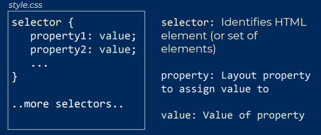
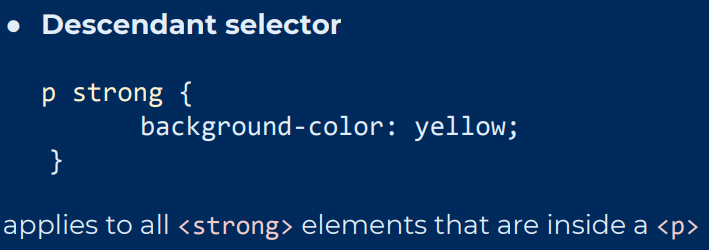

# csc309 notes

## Table of Contents

- [Week 1: Internet and Web](#week-1:-Internet-and-Web)
- [Week 2: HTML & CSS](#Week-2:-HTML-&-CSS)
- [Week 3: JavaScript](#Week-3:-JavaScript)
- [Week 4: JS Objects, DOM](#Week-4:-JS-Objects,-DOM)
- [Week 5: DOM](#Week-5:-DOM)
- [Week 6: JS Events](#Week-6:-JS-Events) 
- [Week 7: Server Side](#Week-7:-Server-Side)

# Week 1: Internet and Web


- Application layer: provides applications with **standardized protocals** to exchange
data. e.g. HTTP, FTP, SSH, SMTP...

- Transport layer: provides **host-to-host** communication services.

- Internet layer: provides protocols for sending **packets** accross a **network** or
through multiple networks.

- Link layer: protocols of the **physical link** between the nodes of
the network, e.g. Ethernet, WiFi...
---
## Client-Server
- Client initiates request to server.
- Server accepts or rejects connection.
- If a connection is established, data can flow until connection terminates.
- TCP/IP facilitates connections between client and server over many networks.
---
## TCP
- **Connection-oriented**, needs to have a pre-arranged connection before sending data.
- **Bi-direnctional**.
- Both client and server should **acknowledge** when they get data.


### ACKnowledgements
- This is an important part of TCP because losing packets are normal.
- If no acknowledgement that packet was received, then packets are sent again.
- TCP is **reliable**, but reacts to losing packets by slowing connection.
---
## Application layer
Web is a **global collection** of resources which are **identifiable**
and **linked** together.

- Global collection: web resources (i.e. text, image, video...) are stored on web servers globally.

- Identifiable: identify and access these web resources using URL

- Linked together: Resources that are similar tend to link to each other.

### HTTP
The protocol gives the client and server a mutual language at the application layer.


HTTP works by **request-response**:
- request from client
- response from server

Request and response originate from Application layer on both sides.

HTTP **request** includes:
- URL: to get to the resource on the server we want.
- HTTP method: to tell the server what we want to do with that resource.

- Request Headers and body: give the server additional information about the request.

HTTP **response** includes:
- Response code: gives standard indicator of the overall status of the response.
- Headers: give the information about the reponse.
- Body: the content of the resource, if available.

### TCP
**Ports**: every process on a computer that uses the internet is assigned a port (TCP or UDP port). Server process that listens for HTTP requests usually uses port 80.


# Week 2: HTML & CSS

### HTML
HTML is a **markup language**:
- Describe a web page's content and structure.
- Not a programming language.

HTML is written as a collection of *elements* which can contain content. *Elements* provides a structure to the document.

---
### CSS
A language that describes the "style" (layout and appearance) of web
pages: separation of content (HTML) and layout (CSS).

*Cascading*: how we style a web page has priority rules.

A sample css file:<br>


Properties include: color, size, shape, position, font, how to align text...

---
### Inline and Block elements
**Block** elements (such as \<p>, \<h1>, \<h2>, \<ul>)
- Height and width can be specified and changed. By default: width is full width of parent element, and height is enough to fit the content.
- Forces creation of newlines.
(Block elements expand naturally and drop below other elements.)

**Inline** elements (such as \<strong>, \<a>, \<br>)
- Don't have defined width/height.
- Can't have block element inside it.

**Inline-block**, inline elements that can have a height/width: images \.

**\<div> and \<span>**:
- Two non-semantic elements: generic - no specific purpose.
- \<span> is a generic inline element, \<div> is a generic block element.
- Used for creating natural divisions throughout the page.

---
### Selectors
- Class is selected by putting a **dot**.
- Id is selected by a **hash symbol**. **Only one** element should have a particular id.

Combining selectors:<br>



When we have **conflicting** selectors, the more **specific** selector takes precedent.

Specificity precedence (from high to low):
- Id
- Class
- Elements: parent elements more specific than children.
- Rules further down style sheet has higher precedence when the specificity is the same.

---
### CSS Box Model: Size


**Recall**: can **only** change height/width for block elements.

---
### CSS Positioning
Positioning of elements refers to a deviation from their natural flow i.e. where the elements are placed by default.<br>


# Week 3: JavaScript

---
## `var`
We can declare variables using the var keyword.They can be accessed within the **function they are declared in** which includes any other
blocks like loops, if-statement, nested functions, etc.

**Declarations** and **definitions** are **seperate**. 

**Hoisting**: all variable and function var declarations are 'hoisted'
up to the top of their function scope (or global scope if not in function). Variable definitions stay in place.

Without var, e.g. `a = 7`, there is no declaration to hoist. Ends up in **global** scope and can be accessed by everyone in lexical scope.

---
## `use strict;`
"use strict" at top of file will help to catch errors, such as defining variables before declaring.

---
## `let` and `const`
Important difference from `var`: they havve **block scope** instead of
**function scope**. Only the current block can access them.

`const` has same scope rules as `let`, used for variables that will not be **re-assigned**.

---
## Closure
A closure is a record storing a function together with an environment.
The environment is a mapping associating each *free variable* of the
function with the value or reference to which the name was bound when
the closure was created.

---
Functions in JS are "first-class objects"<br>
This means they can be:
- stored in a variable
- passed as an argument to a function
- returned from a function

---
## Callback
A callback function is a function passed into another function as an
argument, which is then invoked inside the outer function to complete
some kind of routine or action. 

Callbacks are often used to continue code execution after an **asynchronous** operation has completed.

---
# Week 4: JS Objects, DOM

## Object
An object in JS is simply a set of key-value pairs, where:
- *keys* are called "properties", can be strings or symbols
- *values* can be of any type

```JavaScript
const student = {name: 'Jimmy', year: 2};
const student = {"name": 'Jimmy', "year": 2};

// access using:
student.name
student["name"]
```

---
## `this`
Refers to the containing object of the **call-site** of a function, not where the function is defined.

**Context-dependent**: value of `this` is not obvious from reading function definition.

Can be changed by using `bind()`, `call()` or `apply()`.

---
## Classes
JS works on a **delegation** framework, if a property can't be found
in an object, JS looks for that property in a delegate object.

- No new instances of 'superclasses'.
- Prototypes can be changed at will. No private members.
---
## Prototypes
Prototypes are objects that are used by other objects to add delegate properties.

An object will just have a reference to its prototype. Multiple objects can have the same prototype object reference. (No copies are made.)

Main purpose of a prototype is for fast object creation.

---
### Object creation using functions
One way to create an object is to use functions. These functions are similar to constructors in Java.

Functions have their own prototype property that is used for object creation.

4 things that `new` does:
1. Creates an empty object.
2. Adds the constructor prototype to that object.
3. Call the constructor function with `this` set to the new object.
4. Return the object.

---
### `__proto__` and `prototype`
- `__proto__` is the property of an **object** that points to the object's prototype. 
- `prototype` is the property of a **function** that is used as the prototype to add to the new object when that function is called as a constructor.

---
### Object creation using `Object.create()`
- Another way to create objects using prototypes is by using `Object.create(o)` which creates an object with `o` as the prototype.

- Can create mutiple objects with same prototype. All of their prototypes will point to the same reference. (No instances or copies)

# Week 5: DOM


# Week 6: JS Event
JavaScript is used to define the action that needs to be taken when an
event occurs:
<p align="center">When <strong>HTML Event</strong>, do <strong>JS Action</strong></p>

---
### Setting up listeners in JS:
- An event listener in JS programmatically sets an event attribute on
an HTML element:
```HTML
<div onclick="alert('Clicked!')">...</div>
```
- Select an element in JS, and then:

```JavaScript
element.addEventListener(event, functionToExecuteWhenEventOccurs);
```
where `functionToExecuteWhenEventOccurs` is a `callback` function.

---
## Callback functions
- A callback is a function that is designated to be `called back` at an appropriate time.
- In the case of events, it will be `called back` when the event occurs.
- Can be an anonymous function, or a function defined outside of the event listener.

---
## Event Objects
- All events that occur create a JS Object with information about
that event. (`event.target`-event origin element, `event.type`-type of event)


---
## Non-blocking JS
**Non-blocking** code allows JS to continue executing instructions while we wait for some blocking code to complete.

This feature that allows for non-blocking code is an example of **Asynchronous** programming.

---
## JS runtime engine
- JS must be "compiled" and interpreted, needs a "runtime" environment.
- JS is an **event-driven** language, uses `event loop` to keep track
of all of these events.

---
## JS Event loop
- Javascript is **single-threaded**.
- The event loop: a way of scheduling events one after the other, often with the help of the platform the engine is running on (i.e. browser)

## Event Loop
JavaScript is **single-threaded** which means that it only runs one thing at a time. It implements the **Asynchronous** property by using the **event loop**.

**Event loop** is a way of scheduling events one after the other. It consists of **call stack**, **web APIs** and **callback queue**. 

---
### Visual representation


---
### Stack

```JavaScript
function foo(b) {
    var a = 10;
    return a + b + 11;
}

function bar(x) {
    var y = 3;
    return foo(x * y);
} 

console.log(bar(7));
```
When calling `bar()`, a first frame is created containing the *arguments* and *local variables*. When `bar()` calls `foo()`, a second frame is created and pushed on top of the first one containing `foo()`'s arguments and local variables. When `foo()` returns, the top frame element is popped out of the stack (leaving only `bar()`'s call frame). When `bar()` returns, the stack is empty.

---
### Heap
**Objects** are allocated in a heap which is just a name to denote a large mostly unstructured region of memory.

---
### Queue
A JavaScript runtime uses a message queue, which is a list of messages to be processed. Each message has an associate function which gets called in order to handle the message.

At some point during the event loop, the runtime starts handling the messages on the queue, starting with the **oldest** one. To do so, the message is removed from the queue and its corresponding function is called with the message as an input parameter. As always, calling a function creates a **new stack frame** for that function's use.

The processing of functions **continues until the stack is once again empty** then the event loop will process the next message in the queue (if there is one). 

---
### "Run-to-completion"
Each message is processesd completely before any other message is processed i.e. whenever a function runs, it cannot be pre-empted and will run entirely before any other code runs.

A downside of this model is that if a message takes too long to complete, the web application is unable to process user interactions like click or scroll.

---
# Week 7: Server Side
`Node.js` is a JS runtime environment which allows us to run JavaScript outside of the browser.

Back-end programming involves:
- Communicating with servers, databases (obtaining and manipulating web resources).
- Running the programs that can't easily be run on a client and machine, e.g. complex calculations, fast computation, data storage/persistence and retrieval.

---
# Week 8: Basic Node API

---
# Week 9: Request with Promises

---
# Week 10: MongoDB & Express routes

---
# Week 11: User Authentication & AJAX

---
# Week 12: Sessions/Cookies & Web Securities
HTTP is **stateless**, it simply allows a browser to request a single document from a web server and doesn't remember or keep track of anything between invocations.

However, can use **cookies** on **client** side and **sessions** on server **side** to:
- Remember/track states.
- Uniquely identify each client for the server.
- A way of providing custom content for each client.

---
## Cookies
Cookies are a small piece of data sent by a server to a browser, and then sent back by the browser on future page requests for:
- Authentication
- User tracking
- Personalization


Web server add `Set-cookie:` to HTTP response header, and furture requests from browser to the same server include the `Cookie:` header where each cookie is just a name-value pair.

---
### Browser side
You can use `document.cookie` to manually set/get cookie data:
```JavaScript
document.cookie = 'username=smith';
Cookies.set('username', 'smith');
...
alert(Cookies.get('username'));
```

Mostly only visible to the application (not others on the same browser).</br>
`HttpOnly`: don't allow JavaScript to manipulate cookies, only send back to server i.e. can't use `document.cookies` API.

---
### Lifetime
A *session* cookie i.e. the default type, is a **temporary** cookie that is stored only in the browser's memory, so that when the browser is closed, it is erased. Can't be used for *long-term tracking*. Safer, because *only the browser* has access.

*Persistent* cookies are stored in a file on the browser's computer and can track long-term information. Potentially **less secure** because users can open cookie files, see/change the cookie value, etc.

---
### Problems and limitations
- Browser can disable cookies. Users can disable and delete cookies.
- Size limit/expiration policy.
- Security issues: because they're stored in plain text, can be tampered with.
- Privacy issues: identification of the user.
  

---
## Sessions
A server-side option is *sessions*, which store the current state on the server (i.e. in a file, database). Each request includes a **token** identifying the browser's session.
- Tokens can be passed via cookies, hidden variables, URL rewriting.
- At each request, the executing script uses the **token** to **fetch the session state**.


---
## Web Security
Goals:
- **Confidentiality**: the correct people have access to information.
- **Integrity**: the information is reliable.
- **Availability**: users can accomplish their tasks.

---
### Transport Layer Security (TLS)
Security mechanism underlying HTTPS. 
> Often still called SSL, but the older SSL protocol versions are obsolete and broken.

Client and server use public-key encryption to agree on a shared per-session secret, then use that secret to encrypt session data.


---
### SQL Injection
SQL injection is a technique used to attack data-driven application, in which nefarious SQL statements are inserted into an entry field for execution.

prevention:
- use parameterized queries
- escape everything
- validate input
- never trust raw input

---
### Auth and Sessions
Vulnerabilities:
- User credentials not stored using hashing or encryption.
- Session IDs don't time out.
- Authentication tokens not properly invalidated on log out.

**OAuth**: authorization framework that delegates user authentication to a service that hosts the user account.


---
### Cross-Site Scripting
Data enters web application and is included in dynamic content sent to a web user without being validated for malicious content.

Example: injected script is stored permanently on server, victim retrieves script from server through normal requests.

*Prevention*:
- Escape all untrusted data.

---
### Insecure Direct Object Reference
Attacker is an authorized user, and can gain access to objects by guessing parameters.

Example: `http://example.com/app/accountInfo?acct=notmyacct`

Prevention:
- Ensure user is authorized for access.

---
### Security misconfiguration
- If any of the software is **out of date**. This includes OS, web/app server, DBMS, and all code libararies.
- If *default accounts* and their *passwords* still enabled and unchanged.
- If the error handling reveals **stack traces** or other overly informative error messages to user.
- If the **security settings** in the development frameworks and libraries not set to secure values.
- Then, without a *concreted*, *repeatable* application security configuration process, systems are at a high risk.

---
### Sensitive Data Exposure
If any sensitive data ever transmitted in plain text.

Prevention:
- Encrypt all sensitive data.

---
### Missing Function Level Access Control
Modifies URL, change parameter and gets access to data the attacker is not authorized for.

Often URL in frameworks refers directly to objects.

Prevention:
- Check access authorization on every object.

---
### Cross-Site Request Forgery
Some content on unrelated site includes a `POST` to your application. If a user of your app navigates to compromised site while logged into your app, the malicious `POST` request can pretend to be the user, and steal the user's info from your app.

Prevention: 
- Include an unpredictable token with each HTTP request (usually in a hidden field).

---
### Using components with know security vulnerabilities
Prevention:
- Be careful what you include in your application.
- Update software always.

---
### Unvalidated Redirects and Forwards
Apps use redirects or internal forwards where unvalidated parameters are used.

Example: `http://www.example.com/redirect.jsp?url=evil.com`