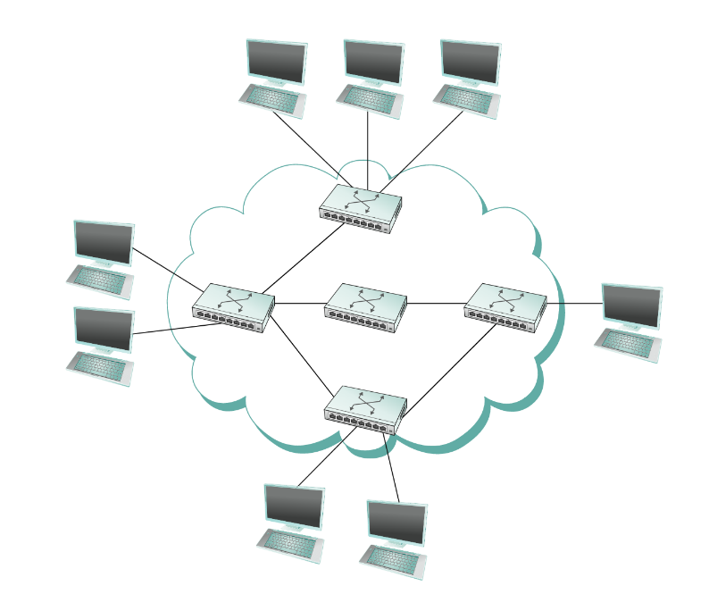
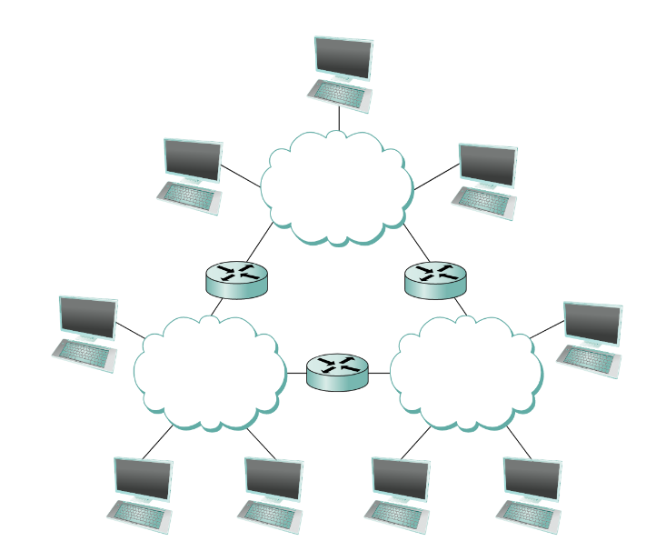
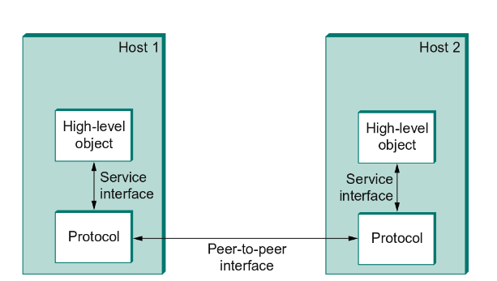
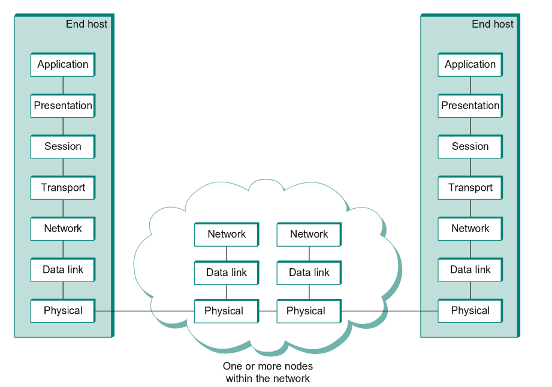
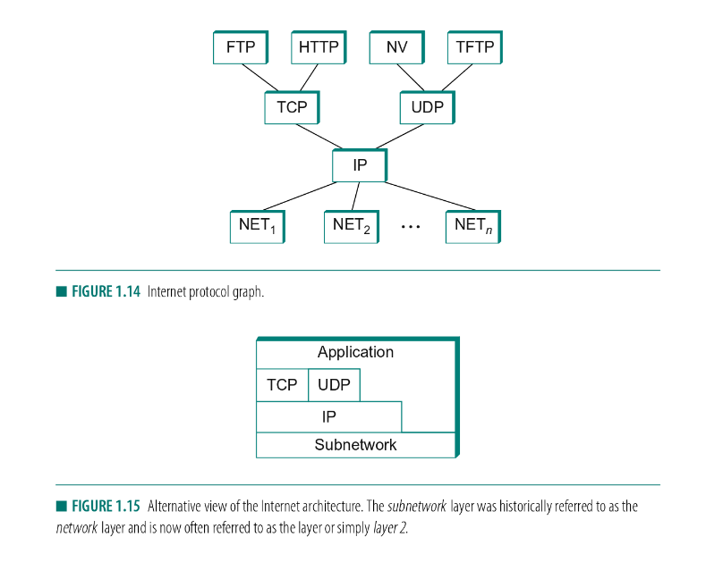

# csc458 notes :weary: :weary: :weary:

## Table of Contents

- [1.1: Applications](#1-1-applications)
- [1.2: Requirements](#1-2-requirements)
- [1.3: Network Architecture](#1-3-network-architecture)

## 1-1 Applications
\- Forms of applications:
* Enable users to view pages full of textual and graphical objects.
* Delivery of "streaming" audio and video.
* Real-time audio and video.

\- Uniform Resource Locator (**URL**): provides a way of identifying all the 
possible objects that can be viewed.

---
## 1-2 Requirements
- Scalable Connectivity: by introducing nodes, links, networks and routers

- Cost-Effective Resource Sharing: by Statistical Multiplexing

- Support for Common Services: by introducing channels
---
### Links and Nodes
\- **Link**: directly connected by some physical medium (cable or optical fiber). We call such a physical medium a **link**.

\- **Node**: refer to the hardware the link connects.

Physical links are sometimes limited to a pair of nodes (said to be <em>point-to-point</em>) , while in other cases more than two nodes may share 
a single physical link (said to be <em>multiple-access</em>). It is often the case that multiple-access links are limited in size (geographical distance / num. of nodes).

---
### Switched Network

\- The fundamental idea of packet switching is to multiplex multiple flows of data over a
single physical link.

\- **Switched network**: formed by nodes that are attached to at leat two 
links and run software that forwards data received on one link out on another.

\- The important feature of packet-switched networks is that the nodes in such a network send
<em>discrete blocks</em> of data to each other. These blocks of data correspond to some piece of 
application data. We call each block of data either a **packet** or a **message**.

\- Difference between packet-switched and circuit-switched network:

<strong>Packet-switched</strong> networks typically use a strategy called **store-and-forward**. 
Each node in a store-and-forward network receives a complete packet over some link, stores the 
packet in its internal memory, and then forwards the complete packet to the next node.

In contrast, a **circuit-switched** network first establishes a dedicated circuit across a sequence of links and then allows the source node to send a stream of bits across thie circuit to
a destination node.

---
### Clouds

- The nodes on the inside are called **switches**, their primary function is to store and 
forward packets.
- The nodes on the outside of the cloud that use the network are called **hosts**, and they 
support users and run application programs.

The cloud is a placeholder for any of the networking technologies covered above.

A set of independent networks (clouds) are interconnected to form an <em>internetwork</em>, or
internet for short. We can recursively build arbitrarily large networks by interconnecting 
clouds to form larger clouds.

---
### Routers and Routing

\- A node that is connected to two or more networks (the clouds) is commonly called a **router** 
or **gateway**. It forwards message from one network to another.

\- Each node must be able to say which of the other nodes on the network it wants to communicate
with. This is done by assigning an **address** to each node. The network can use a node's address
to distinguish it from the other nodes. When a source node wants the network to deliver a 
message to a certain destination node, it specifies the address of the destination node, then the
switches and routers of the network use this address to decide how to forward the message toward
the destination. This process is called **routing**.

---
### Statistical Multiplexing / Cost-Effective Resource Sharing

\- **Multiplexing**: a system resource is shared among multiple users. Data being sent by 
multiple users can be multiplexed over the physical links that make up a network.

\- Different methods for multiplexing flows onto one physical link:
- <em>synchronous time-division multiplexing</em> (STDM): divide time into equal-sized quanta
and, in a round-robin fasion, give each flow a chance to send its data over the physical link.

- <em>frequency-division multiplexing</em> (FDM): transmit each flow over the physical link at
a different frequency.

Two methods above are limited in two ways:
1. if one of the flows does not have any data to send, its share of the physical link remains 
idle.
2. both STDM and FDM are limited to situations in which the maximum number of flows is fixed and
known ahead of time since it's not practical to resize the quantum or add new frequencies duing
the transmition.

\- **Statistical Multiplexing** is like STDM in that the physical link is shared over time, 
however, data is transmitted from each flow on demand rather than during a predetermined time 
slot i.e. it gets to transmit the data without waiting for its quantum of come around.

\- Statistical multiplexing has a mechanism to ensure that all the flows eventually get their
turn to transmit over the physical link. It defines an **upper bound** on the size of the
block of data that each flow is permitted to transmit at a given time. This <em>limited-size</em>
block of data is typically referred to as a **packet** (which differs from an arbitrarily large <em>message</em>).

\- Because a packet-switched network limits the maximum size of packets, a host may not be able 
to send a complete message in one packet. The source may need to fragment the message into 
several packets, with the receiver reassambling the packets back into the origianl message.

\- If the switch receives packets faster than the shared link can accommodate, it is forced to buffer these packets in its memory.

\- **Congestion**: if a switch receives packets faster than it can send for an extended 
period of time, then the switch will eventually run out of buffer space, and some packets will 
have to be dropped.

---
### Channel
\- We can think of the <em>channel</em> as being like a pipe connecting two applications, so that
a sending application can put data in one end and expect that data to be delivered by the network
to the application at the other end of the pipe.

\- The process that requests access to the file is called the **client**, the process that 
supports access to the file is caled the **server**.

Reading a file involves the client sending a small request message to a server and the server
responding with a large message that contains the data in the file.

Writing a file involves the client sending a large message containing the data to be written to
the server, and the server responds with a small message confirming that the write to disk has
taken place.

---
### Reliablity

\- Problems: machines crash and later are rebooted, fibers are cut, electrical interference 
corrupts bits in the data being transmitted, switches run out of buffer space.

\- Three general classes of failure: 
- <em>bit erros</em>: a 1 is turned into a 0 or vice versa. If several consecutive bits are
corrupted, it's called <em>burst error</em>.

- A complete packet is lost by the network. If the packet contains an uncorrectable bit error, then it will be dropped. Can also be dropped if a switch's buffer is overloaded.

- A physical link is cut, or the computer it is connected to crashes.

---
## 1-3 Network Architecture

### Layering
\- Layering provides an **abstraction** for applications that hides the complexity of the 
network.

You start with the services offered by the underlying hardware and then add a sequence of layers,
each providing a higher level of services. The services provided at the high layers are 
implemented in terms of the services provided by the low layers.

\- Layering provides two features:
- It decomposes the problem of building a network into more manageable components.
- It provides a more modular design, e.g. if you decide that you want to add some new service, 
you may only need to modify the functionality at one layer.

---
### Protocals
\- The abstract objects that make up the layers of a network system are called **protocals**. It
provides a communication service that higher-level objects use to exchange messges.

\- Each protocal defines 2 different interfaces:
1. <em>Service interface</em> defines the operations that local objects can perform on the 
protocal. (e.g. HTTP supports an operation to fetch a page of hypertext from a remote server.)

2. <em>Peer interface</em> defines the form and meaning of messages exchanged between protocal
peers to implement the communication service. (e.g. HTTP defines how a GET cmd is formatted. )

Peer-to-peer communication is indirect -- each protocal communicates with its peer by passing
messages to some lower-level protocal, which in turn delivers the message to its peer.

We call the set of rules governing the form and content of a protocal graph a **network architecture**.

---
### Encapsulation

\- A **header** is a small data structure that is used among peers to communicate with each 
other. The exact format for the header is defined by its protocal specification. The data 
being transmitted is called the message's **body**/payload.

---
### Multiplexing and Demultiplexing
\- The header contains the <em>demultiplexing key</em> that records the application to which
the message belongs. When the message is delivered to the host, it strips its header, examines
the demux key, and demultiplexes the message to the correct application.

---
### The 7-Layer Model

- **Physical** layer handles the transmission of raw bits over a communication link.

- **Data link** layer then collects a stream of bits into a larger aggregate called a <em>frame</em>. (Network adapters / device drivers typically implemented in this layer.)

-  **Network** layer handles routing among nodes within a packet-switched network. At this layer,
the unit of data exchanged is typically called **packet**.

The lower three layers are implemented on all network nodes. The transport layer and higher
layers typically run only on the end hosts and not on the intermediate switches or routers.

- **Transport** layer then implements a process-to-process channel. Here, the unit of data
exchanged is commonly called a **message** rather than a packet or a frame.

- Session layer provides a name space that is used to tie together the potentially different
transport streams that are part of a single application e.g. manage an audio stream and video
stream that are being combined in a teleconferencing application.

- Presentation layer is concerned with the format of data exchanged.

- Application layer protocals include things like HTTP which enables web browsers to request 
pages from web servers.

---
### Internet Architecture

- At the lowest level is a wide variety of network protocals. These protocals are implemented by
a combination of hardware (e.g. network adapter)and software (e.g. driver).

- The second layer consists of a single protocal -- **IP** which supports the interconnection
of multiple networking technologies into a single, logical internetwork.

- The third layer contains **TCP** (transmission control protocal) and **UDP** (user datagram 
protocal). TCP provides a reliable byte-stream channel, and UDP provides an unreliable datagram
(message) delivery channel. These two protocals are sometimes called end-to-end protocals.

- Running above the transport layer is a range of application protocals, such as HTTP, FTP, and
SMTP.

The internet architecture has these features:
1. The application is free to bypass the defined transport layers and to directly use IP or one
of the underlying networks.

2. IP defines a common method for exchanging packets among a wide collection of networks. Above 
IP there can be arbitrarily many transport protocals, each offering a different channel 
abstraction to applications. Thus, the issue of delivering messages from host to host is 
completely seperated from the issue of providing a useful process-to-process communication
service.

---
## Link Layer

---
### 2.6.1 Physical Properties

- A **transceiver**, a small device directly attached to the tap, detected when the line was **idle**
and drove the signal when the host was transmitting. It also received incoming signals.

- A **repeater** is a device that forwards digital signals, (much like an amplifier), no more than 4 repeaters
could be positioned between any pair of hosts.

- A **hub** just repeats whatever it hears on one port out all its other ports.

(Repeaters and hubs forward the signal on **all** outgoing segments. The hosts are in the same *collision domain*
if they are competing for the same link.)

---
### 2.6.2 Access Protocal
The algorithm that controls access to a shared Ethernet link is called *media access control* (**MAC**).

Frame format:
- The 64-bit **preamble** allows the receiver to synchronize with the signal.
- Both the **source** and **destination** hosts are identified with a 48-bit address.
- The packet type field serves as the demultiplexing key.
- A 32-bit CRC.
- Each frame contains up to 1500 bytes of data. Minimally, contains at least 46 bytes since the frame needs to be long
enough to detect a collision.
- The sending adapter attaches the preamble and CRC before transmitting, and the receiver adapter removes them.

Addresses: 
An Ethernet address consisting of **all 1's** is treated as a **broadcast** address; all adaptors pass frames adressed
to the broadcast address up to the host. *Multicast address* sets the first bit to 1.

An Ethernet adaptor receives all frames and accepts:
- Frames addressed to its **own** address.
- Frames addressed to the **broadcast** address.
- Frames addressed to a multicast address, if it has been instructed to listen to that address.
- All frames if it is in promiscuous mode.

Transmitter Algorithm: 
When the adaptor has a frame to send and the line is idle, it transmits the frame immediately; there is no negotiation
with the other adaptors. The upper bound of 1500 bytes means that the line can only be occupied for a fixed length of
time.

It takes at most *2d* to detect a collision i.e. two adaptors transmitting at the same time. Once an adaptor has
detected a collision and stopped its transmission, it doubles then amount of time it waits before trying again 
(**exponential backoff**).

---
### 3.1 Switching and Bridging
A switch is a mechanism that allows us to interconnect links to form a larger network. A switch's primary job is
to receive incoming packets on one of its links and to transmit them on some other link.

> The only requirement for Ethernet addresses is that no two nodes on a network have the same address.

---
### 3.1.4 Bridge and LAN switches
A bridge is a node with a pair of Ethernet adaptors and forwards frames from one Ethernet to another. This node
will also fully implement the Ethernet's collision detection.

**Learning Bridges**: 
Each packet carries a global address, and the bridge decides which output to send a packet on by looking up that
address in a table. When a bridge first boots, this table is empty; entries are added and discarded over time.

When a frame is addressed to a host **not** currently in the table, it goes ahead and forwards the frame out on **all** the
other ports.

**Spanning Tree Algorithm**: 
Problem: loops are built into the network on purpose -- to provide redundancy in case of failure. Since a network with
no loops needs only **one** link failure to become split into two separate partitions.

Algo: 
- Initially, each bridge thinks it is the root, and so it sends a configuration message out on each of its ports identifying
it self as the root and gives a distance to root of 0.
- The bridge checks to see if a new message received is better than the current best config msg recorded for that port.
- When a bridge receives a configuration message that indicates it is not the designated bridge for that port, it stops 
sending configuration msg over that port.
- When the system stabilizes, only the **root** bridge is still generating config msg, and the other bridges are forwarding
these msg only over ports for which they are the designated bridge.

This algo is not able to forward frames over alternative paths for the sake of routing around a congested bridge.

**Limitations of Bridges**: 
It is not realistic to connect more than a few LANs by means of bridges. One reason for this is that the spanning tree algo
scales linearly. The other reason is that bridges forward all broadcast frames.

---
## Network Layer
---
### 3.2.1 Basic concepts for IP
Internet refers to an arbitrary collection of networks interconnected to provide some sort of host-to-host packet delivery
service. The nodes that interconnect the networks are called **routers**.

**IP** runs on **all** the nodes in a collection of networks and defines the infrastructure that allows these nodes and
networks to function as a single logical internetwork.

The IP service model has two parts:
- An addressing scheme, which provides a way to **identify all hosts** in the internetwork.
- A datagram model of **data delivery**.

*Datagram Delivery* 
A datagram is a type of packet that happens to be sent in a **connectionless** and **unreliable** manner over a network. Every datagram carries
enough information to let the network forward the packet to its correct destination.

*Packet Format*
- The Version field specifies the version of IP.
- HLen specifies the length of the header in 32-bit words.
- 8-bit TOS: allow packets to be treated differently based on application needs.
- Length: length of the datagram, including the header. Counts bytes rather than words, unlike HLen.
- TTL: catch packets that have been going around in routing loops and discard them.
- Protocal: a demultiplexing key that identifies the higher-level protocol to which this IP packet should be passed.
- Checksum: calculated by considering the **entire** IP header as a sequence of 16-bit words, adding them up using
ones complement arithmatic, and taking the ones complement of the result. (Checksum is not as strong as CRC, but much easier
to calculate in software.)
- **SourceAddr**: the source address is required to allow recipients to decide if they want to accept the packet and to
enable them to reply.
- **DestinationAddr**: every packet contains a full address for its intended destination so that forwarding decisions can
be made at each router.

*Fragmentation and Reassembly* 
Every network type has a *maximum transmission unit*(MTU), which is the largest IP datagram that it can carry in a frame.

To enable these fragmentations to be reassambled, at the receiving host, they all carry the same identifier in the **Ident** field.

Reassembly is done at the **receiving host** and **not at each router**.

---
### 3.2.3 Global Addresses (32-bit long)
Global uniqueness is the first property that should be provided in an addressing scheme.

Ethernet addresses do **not** have a structure, IP addresses are **hierarchical** by contrast. 

IP addresses consist of two parts, usually referred to a *network* part and a *host* part:
- Network part identifies the network to which the host is attached.
- Host part identifies each host uniquely on that particular network.

---
### 3.2.4 Datagram Forwarding in IP
Forwarding is the process of taking a packet from an input and sending it out on the appropriate output, while
*routing* is the process of building up the tables that allow the correct output for a packet to be determined.

---
### 3.2.5 Subnetting and Classless Addressing
Problem: The amount of state that is stored in a node participating in a routing protocol is **proportional** to the
number of other nodes. Thus, the more network numbers there are in use, the bigger the forwarding tables get. Big
forwarding tables add costs to routers, and they are potentially slower to search than smaller tables.

---
**Subnetting** 
takes a single IP network number and allocate the IP addresses with that network number to several physical networks,
which are now referred to as *subnets*. All hosts on the same physical network will have the same subnet number, which
means that hosts may be on different physical networks but share a single network number.

There is **exactly one** subnet mask per subnet. The bitwise AND of the IP address and subnet mask defines the subnet number of all hosts on the same subnet.

A default route would usually be included in the table and would be used if no explicit matches were found.

---
**CIDR** 
Subnetting only allows us to split a classful address among multiple subnets, while CIDR allows us to combine
several classful addresses into a single "supernet". It balances the desire to **minimize** the number of routes
that a router needs to know against the need to hand out addresses efficiently.

It uses a single entry in a forwarding table to tell us how to reach of lot of different networks.

---
### 3.2.6 ARP
Problem: IP datagrams contain IP addresses, but the physical interface hardware on the host or router to which you want to send the datagram only understands
the addressing scheme of that particular network. Thus, we need to translate the IP address to a link-level address that makes sense on this network (e.g. 48-bit Ethernet address).

A host wishing to obtain a physical address broadcasrs an ARP request, and the host on the network that has the IP
address in the request then replies with its physical hardware address.

---
### 3.2.8 ICMP
*Internet Control Message Protocol* (ICMP) defines a collection of error messages that are sent back to the source
host whenever a router or host is unable to process an IP datagram successfully.

*ICMP-Redirect* tells the source host that there is a better route to the destination.

ICMP also provides the basis for two widely used debugging tools, `ping` and `traceroute`.
