# Lecture 5 Internet Topology

### Link-State Routing
- Topology information is flooded which causes high bandwidth and storage overhead.
- Entire path computed locally per node which causes high processing overhead in a large network.
- Minimizes some notion of total distance, works only if policy is shared and uniform.
- Typically used only inside an AS.

---
### Distance Vector
Advantages:
- Hides details of the network topology.
- Nodes determine only 'next hop' toward the dest.

Disadvantages:
- Minimizes some notion of total distance, which is difficult in an interdomain setting.
- Slow convergence due to the counting-to-infinity problem.

---
### Path Vector
- Extension of distance-vector routing.
- Path vector sends the entire path for each dest where distance vector sends distance metric per dest d.
- Node can easily detect a loop by looking for its own node identifier in the path.
- Node can simply discard paths with loops.

## Border Gateway Protocol (BGP)
- BGP is a path-vector routing protocol.
- BGP advertises complete paths.
- Paths with loops are detected locally and ignored.
- Local policies pick the preferred path among options.

---
### Incremental Protocol
- A node learns multiple paths to destination: stores all of the routes in a routing table, applies policy to select a single active route, and may advertise the route to its neighbors.
- Incremental updates: 1. Announcement: upon selecting a new active route, add node id to path and (optionally) advertise to each neighbor. 2. Withdrawal: if the active route is no longer available, send a withdrawal message to the neighbors. 

---
### BGP route selection summary
1. Highest Local Preference: enforce relationships e.g. prefer customer routes over peer routes.
2. Shortest AS path, i-BGP < e-BGP.
3. Lowest router ID.

---
### BGP policy
Import policy:
- Filter unwanted routes from neighbor, e.g. prefix that your customer doesn't own.
- Manipulate attributes to influence path selection, e.g. assign local preference to favored routes.

Export policy:
- Filter routes you don't want to tell your neighbor, e.g. don't tell a peer a route learned from other peer.
- Manipulate attributes to control what they see, e.g. make a path look artificially longer than it is.

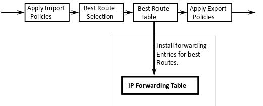

#### Import policy: local preference
- Favor one path over another. Override the influence of AS path length, apply local policies to prefer a path.
- Example: prefer customer over peer.

#### Import policy: Filtering
- Discard some route announcements.
- Examples: Discard route if prefix not owned by the cutomer. Discard route that contains other large ISP in AS path.

#### Export policy: Filtering
- Discard some route announcements.
- Examples: Don't announce routes from one peer to another. Don't announce routes for network-management hosts.

#### Export policy: Attribute Manipulation
- Modify attributes of the active route, i.e. to influence the way other AS's behave.
- Example: AS prepending. Artificially inflate the AS path length seen by others. To convince some AS's to send traffic another way.

---
### Joining BGP and IGP information
Border Gateway Protocol (**BGP**)
- Announces reachability to external destinations.
- Maps a destination prefix to an egress point, e.g. 128.112.0.0/16 reached via 192.0.2.1

Interior Gateway Protocol (**IGP**)
- Used to compute paths within the AS.
- Maps an egress point to an outgoing link, e.g. 192.0.2.1 reached via 10.10.10.10

---
### Causes of BGP Routing Changes
- **Topology changes**, e.g. equipment going up or down, deployment of new routers or sessions.
- **BGP session failures**, e.g. due to equipment failures, maintenance, etc. Or, due to congestion on the physical path.
- **Changes in routing policy**, e.g. reconfiguration of preferences, reconfiguration of router filters.
- **Persistent protocol oscillation**, e.g. conflicts between policies in different AS's.

---
#### BGP converges slowly
- Path vector avoids count-to-infinity. But, AS's still must explore many alternate paths to find the highest-ranked path that is still available.
- In practice, most popular destinations have very stable BGP routes, and most instability lies in a few unpopular destinations.
- Still, lower BGP convergence delay is a goal. High for important interactive applications.

---
### Conclusions
BGP is a routing protocol operating at a global scale, with tens of thousands of independent networks that each have their **own policy goals** and all want **fast convergence**.

Key features of BGP:
- Prefix-based path-vector protocol.
- Incremental updates (announcements and withdrawls)
- Policies applied at import and export of routes.
- Internal BGP to distribute information within AS.
- Interaction with the IGP to compute forwarding tables.

# Leture 6: Transport Protocol

Transport layer:
- Communication between processes (e.g. sockets).
- Relies on network layer and serves the application layer.

**Sender**: breaks application messages into segments, and passes to network layer.

**Receiver**: reassembles segments into messages, passes to application layer.

**UDP**:
- No-frills extension of 'best effort' IP.

**TCP**:
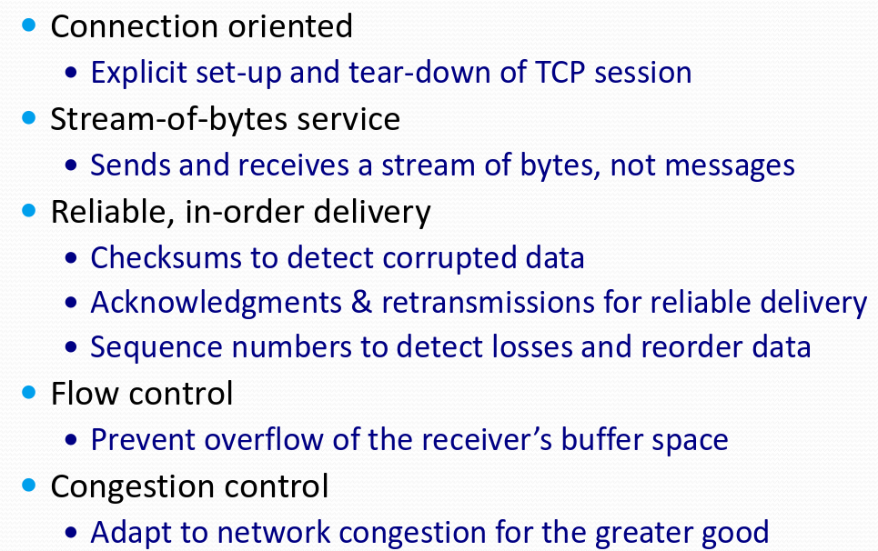

---
### Demultiplexing
Each IP datagram host received has:
- source and destination **IP address**.
- one transport-layer segment.
- source and destination **port number**.
- Host uses IP addresses and port numbers to direct segment to appropriate socket.

---
## UDP

#### Advantages:
- **Finer control** over what data is sent and when. As soon as an application process writes into the socket, UDP will package the data and send the packet.
- **No delay** for connection establishment. UDP just blasts away without any formal preliminaries which avoids introducing any unnecessary delays.
- No connection state. No allocation of buffers, parameters, sequence numbers, etc. making it easier to handle many active clients at once.
- **Smaller packet header overhead**. UDP header is only eight-bytes long.

#### Applications
- Multimedia streaming: retransmitting lost/corrupted packets is not worthwile, e.g. telephone calls, video conferencing, gaming.
- Simple query protocols like Domain Name System (DNS): overhead of connection establishment is overkill, easier to have application retransmit if needed.

---
## Transmission Control Protocol (TCP)

#### Support for Reliable Delivery
- Checksum: used to detect corrupted data at the receiver, leading the receiver to drop the packet.
- Sequence numbers: used to detect missing data, and for putting the data back in order.
- Retransmission: sender retransmits lost or corrupted data, timeout based on estimates of RTT.

---
### TCP Segment

A segment is sent when:
1. Segment full (Max Segment Size).
2. Not full, but times out, or
3. 'Pushed' by application.

- IP packet: no bigger than MTU, e.g. up to 1500 bytes on an Ethernet.
- TCP packet: TCP header is typically 20 bytes long.
- TCP segment: No more than Maximum Segment Size (MSS) bytes.

---
#### Initial Sequence Number (ISN)
TCP requires changing the ISN over time because:
- IP addresses and port numbers uniquely identify a connection. 
- Eventually, these port numbers do get used again,
- ... and there is a chance an old packet is still in flight
- ... and might be associated with the new connection.
- Set from a 32-bit clock that ticks every 4 microseconds, which only wraps around once every 4.55 hours.

---
#### Automatic Repeat Request (ARQ)
- Receiver sends ACK when it receives packet.
- Sender waits for ACK and timeouts if it does not arrive within some time period.

TCP sets timeout as a function of RTT:
- Expect ACK to arrive after an RTT.
- Smooth estimate: `EstimatedRTT = a * EstimatedRTT + (1 - a) * SampleRTT`.
- Compute timeout: `Timeout = 2 * EstimatedRTT`
- **Karn/Partridge** algorithm: only collect sample RTT's for segments sent one single time.

---
### Sliding window
Stop-and-wait is inefficient especially when delay-bandwidth product is high. However, sliding window allows a larger amount of data 'in flight'.

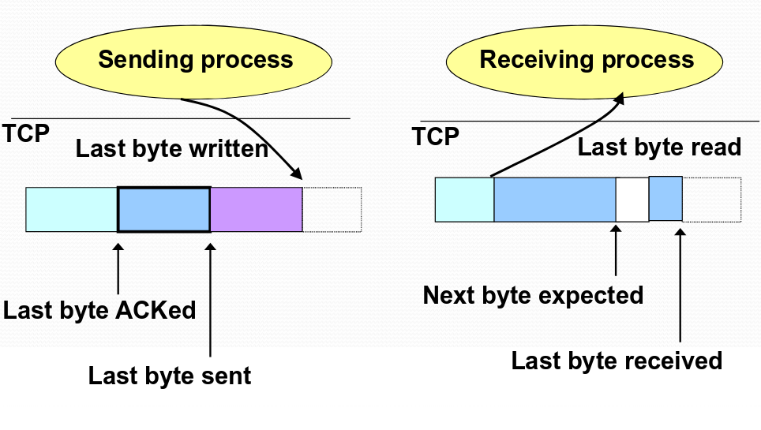

TCP adds flow control to the sliding window, `ACK + WIN` is the sender's limit:

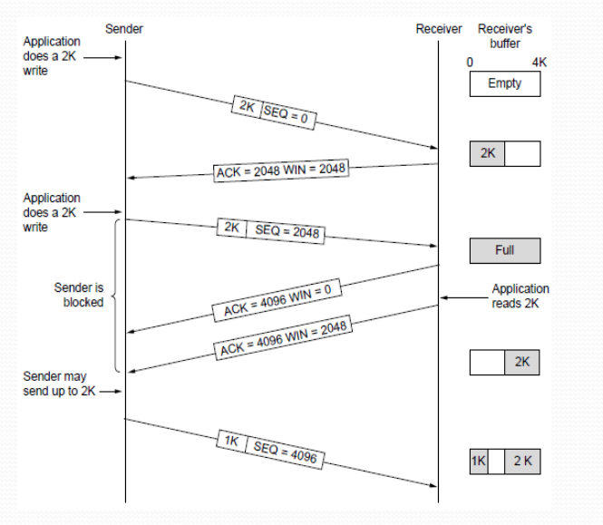

---
#### Receiver buffering
Window size:
- Amount that can be sent without ACK.
- Receiver needs to be able to store this amount of data.

Receiver advertises the window to the sender:
- Tells the sender the amount of free space left
- ... and the sender agrees not to exceed this amount.

---
#### Fast Retransmission
Sender retransmits data after **triple duplicate ACKs**:
- Although packet `n` might have been lost,
- ... packet `n + 1`, `n + 2`, and so on might get through.
- ACK says that receiver is still awaiting `n_th` packet, and repeated ACKs suggest that later packets have arrived.
- The sender views the duplicate ACKs as a hint that the `n_th` packet must have been lost and perform the retransmission.

Effectiveness of Fast Retransmission:
- Long data transfers: high likelihood of many packets in flight.
- High window size: high likelihood of many packets in flight.
- Low burstiness in packet losses: higher likelihood that later packets arrive successfully.
- Implications for web traffic: most web transfers are short, so often there aren't many packets in flight and more likely forcing users to 'reload' more often.

---
### Tearing down the connection
- FIN to close and receive remaining bytes.
- RST to close and not receive remaining bytes.
- Other hosts send a FIN ACK to acknowledge.

Sending a FIN `close()`:
- Process is done sending data via the socket.
- Process invokes `close()` to close the socket.
- Once TCP has sent all of the outstanding bytes, then TCP sends a FIN.

Receiving a FIN `EOF`:
- Process is reading data from the socket.
- Eventually, the attempt to read returns an `EOF`.

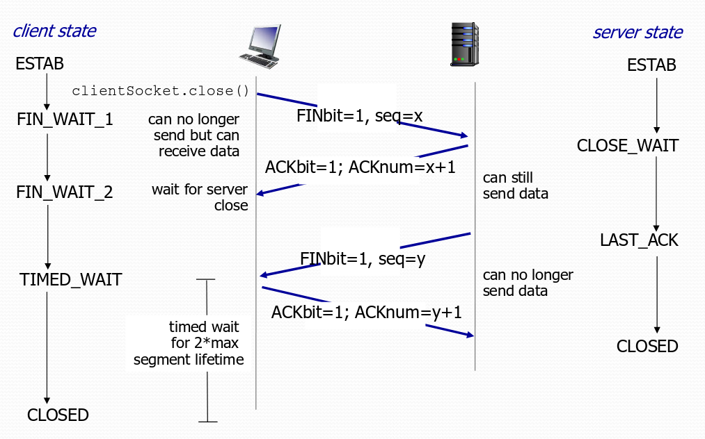

---
# Lecture 7: Congestion Control

#### Flow control vs. Congestion control
- Flow control: keep one fast sender from overwhelming a slow receiver.
- Congestion control: keep a set of senders from overloading the network.
- A fast network feeding a low-capacity receiver -> flow control
- A slow network feeding a high-capacity receiver -> congestion control
  
Similar mechanisms:
- TCP flow control: receiver window
- TCP congestion control: congestion window
- TCP window: min{congestion window, receiver window}

---
#### Congestion is unavoidable
- Two packets arrive at the same time. The node can only transmit one, and either buffer or drop the other.
- If many packets arrive in a short period of time. The node cannot keep up with the arriving traffic, and the buffer may eventually overflow.
  
---
#### Advantages of having congestion:
- It makes efficient use of the link, and buffers in the routers are frequently occupied.
- If buffers are always empty, delay is low, but our usage of the network is low. If buffers are always occupied, delay is high, but we are using the network more efficiently.

### Congestion Collapse
Increase in network load results in a decrease of useful work done.
- Spurious retransmission of packets still in flight. Solution: better timers and TCP congestion control.
- Undelivered packets. Packets consume resources and are dropped elsewhere in network. Solution: congestion control for *all* traffic.

---
### Simple congestion detection
- Packet loss: timeout or triple-duplicate ACK
- Packet delay: RTT estimate

---
### TCP Congestion Control
- TCP implements **host-based**, **feedback-based**, **window-based** congestion control.
- TCP sources attempts to determine how much capacity is available.
- TCP sends packets, then reacts to observable events like packet loss.

#### Idea of TCP Congestion Control
- Each source determines the available capacity so it knows how many packets to have in transit.
- Congestion window: maximum number of unacknowledged bytes to have in transit. Send at the rate of the slowest component: receiver or network.
- Adapting the congestion window: decrease upon losing a packet, increase upon success.
- `LastByteSent - LastByteAcked <= cwnd`
- `rate ~= cwnd/RTT` bytes/s

---
#### Additive Increase, Multiplicative Decrease
- Increase linearly, decrease multiplicatively.
- A necessary condition for stability of TCP.
- Consequence of over-sized window are much worse than having an under-sized window.
- Increase: `cwnd += MSS * (MSS / cwnd)`
- Decrease: `cwnd \= 2` (never dropped below 1 MSS)

---
### Slow start phase
- Start with a small congestion window. Initially, cwnd is 1 MSS. So, the initial sending rate is MSS/RTT.
- Could be wasteful because this might be much less than the actual bandwidth and linear increase takes a long time to accelerate.
- Slow-start phase: Sender starts at a slow state,
- ... but increases the rate exponentially
- ... until the first loss event.   

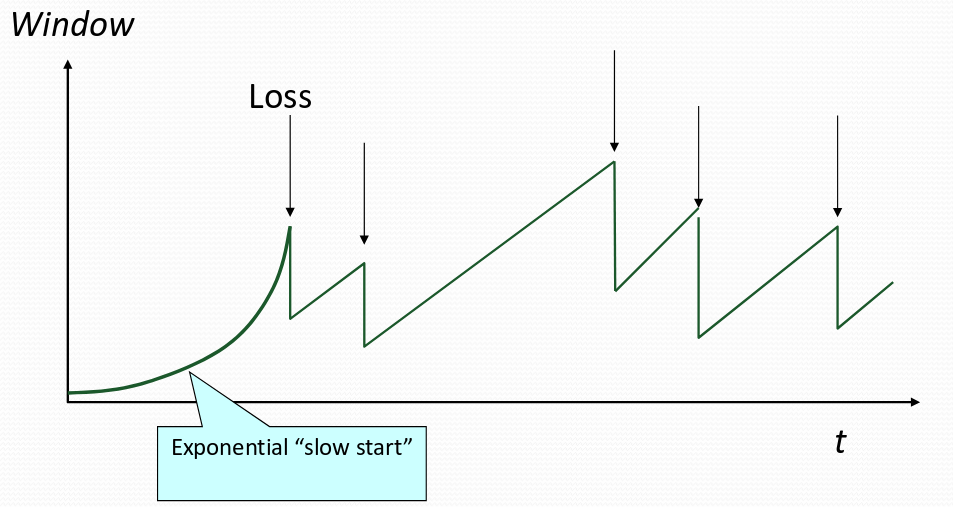

### Two kinds of LOSS in TCP

**Triple duplicate ACK**
- Packet `n` is lost, but packets `n + 1`, `n + 2`, etc. arrive.
- Receiver sends duplicate ACKs.
- ... and the sender retransmits packet `n` quickly.
- Do a **mulplicative decrease** and keep going.

**Timeout**
- Packet `n` is lost and detected via a timeout,
- e.g. because all packets in flight were lost.
- After the timeout, blasting away for the entire cwnd
- ... would trigger a very large burst in traffic.
- So, better to start over with a low cwnd.

---
#### Repeating slow start after timeout
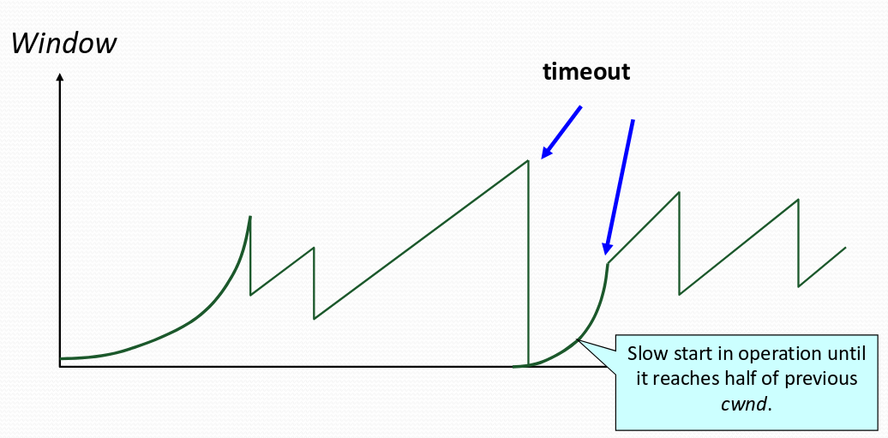

#### Repeating slow start after idle period
- Suppose a TCP connection goes idle for a while.
- Eventually, the network conditions change. (Maybe many more flows are traversing the link)
- Dangerous to start transmitting at the old rate. Previously-idle TCP sender might blast the network and cause excessive congestion and packet loss.
- So, some TCP implementations repeat slow start.

---
### Nagle's Algorithm
> Some interactive applications like Telnet or ssh generate only small packets, and Since small packets are wastefull. It's appealing to reduce the number of packets by forcing every packet to have some minimum size. Therefore, we need to balance the competing trade-offs by sending larger packets without introducing much delay by waiting.

- Wait if the amount of data is small (smaller than MSS).
- Wait if some other packet is already in flight i.e. still awaiting the ACKs for previous packets.
- That is, send at most one small packet per RTT, by waiting until all outstanding ACKs have arrived.

---
### Delayed ACK
- TCP traffic is often bidirectional, both data and ACKs are traveling in both directions.
- However, ACK packets have high overhead (40B for headers and 0B for data),
- Therefore, piggybacking is appealing.

- Upon receiving a packet, the host B sets a timer. Typically 200 msec or 500 msec.
- If B's application generates data, send and piggyback the ACK bit.
- If the timer expires, send a (non-piggybacked) ACK.

---
# Lecture 8: Queueing Mechanisms, Middleboxes

## Random Early Detection (RED)
- Router notices that the queue is getting backlogged,
- ... and randomly drops packets to signal congestion.
- Drop probability increases as queue length increases.
- If buffer is below some level, don't drop anything,
- ... otherwise, set drop probability as function of queue.

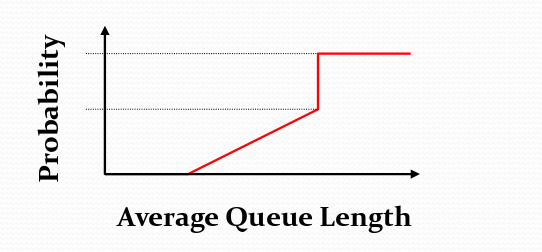

### Properties of RED
- Drops packets before queue is full. In the hope of reducing the rates of some flows.
- Drops packet in proportion to each flow's rate. High-rate flows have more packets and hence, a higher chance of being selected.
- Drops are spaced out in time, which should help desynchronize the TCP senders.
- Tolerant of burstiness in the traffic, by basing the decisions on average queue length.

---
#### More about Fairness
Fairness and UDP
- Multimedia apps often do not use tcp, do not want rate throttled by congestion control.
- Instead, use udp to send audio/video at constant rate, tolerate packet loss.

#### Fairness, parallel TCP connections
- App can open multiple parallel connections between two hosts.
- Web browsers do this.

---
## Explicit Congestion Notification (ECN)
- Two bits in IP header (ToS) marked **by network router** to indicate congestion.
- Congestion indication carried to receiving host.
- Receiver (after seeing congestion indication in IP datagram) sets ECE bit on receiver-to-sender ACK to notify sender of congestion.

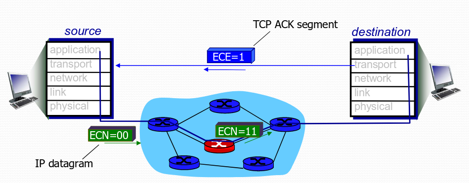

---
## Middleboxes
- Interposed in-between the communicating hosts.
- Often without knowledge of one or both parties.
- e.g. Network address translator, firewalls and web proxies.

Middleboxes address important problems:
- Using fewer IP addresses.
- Blocking unwanted traffic.
- Making fair use of network resources.
- Improving web performance.

Problems:
- No longer globally unique IP addresses.
- No longer can assume network simply delivers packets.

---
## Network Address Translation (NAT)
Share addresses among numerous devices without requiring changes to existing hosts.

#### IP header translator
- Local network addresses not globally unique.
- NAT box rewrites the IP addresses. (Make the "inside" look like a single IP address, and change header checksums accordingly.)
- Outbound traffic: rewrite the source IP address.
- Inbound traffic: rewrite the destination IP address.

---
#### Port-Translating NAT
Map outgoing packets:
- Replace source address with NAT address. 
- Replace source port number with a new port number. 
- Remote hosts repond using `(NAT addr, new port #)`.

Maintain a translation table, store map of `(source addr, port #)` to `(NAT addr, new port #)`.

Map incoming packets:
- Consult the translation table.
- Map the destination address and port number.
- Local host receives the incoming packet.

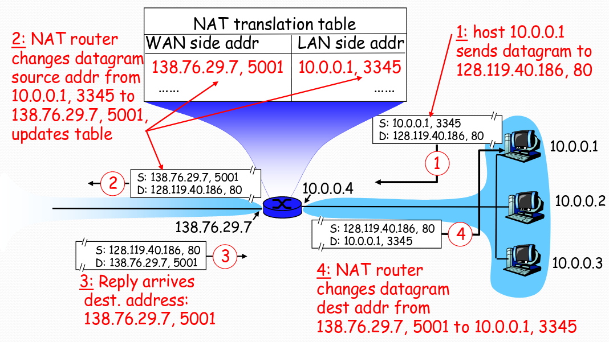

---
#### Maintaining the mapping table
- Create an entry upon seeing a packet, packet with new `(src addr, src port)` pair.
- If no packets arrive within a time window, then delete the mapping to free up the port numbers.

---
#### Objections against NAT
- Difficult to support peer-to-peer applications. P2P needs a host to act as a server, difficult if both hosts are behind NAT.
- Routers are not supposed to look at port numbers. Network layer should only care about IP header, and not be looking at the port numbers at all.
- NAT violates the end-to-end argument. Network nodes should not modify the packets.
- IPv6 is a cleaner solution (better to migrate than to limp along with a hack).

---
## Firewalls
Isolates organization's internal net from larger Internet, allowing some packets to pass, blocking others.

---
#### Denial of Service
- Outsider overwhelms the host with unsolicited traffic with the goal of preventing any useful work. 
- By taking over a large collection of hosts 
- ... and program these hosts to send traffic to your host 
- ... lead to excessive traffic.

#### Break-Ins
- Outsider exploits a vulnerability in the end host
- ... with the goal of changing the behavior of the host.

---
### Packet Filtering
Internal network connected to Internet via firewall. 
Firewall filters packet-by-packet, based on:
- src IP addr, dest IP addr
- TCP/UDP src and dest port numbers
- ICMP message type
- TCP SYN and ACK bits

### Traffic Management
- Classify the traffic based on rules, and then handle the classes of traffic differently.
- Limit the amount of bandwidth for certain traffic.
- Seperate queues. Use rules to group related packets, and then do round-robin scheduling across the groups.

#### Firewall Implementation Challenges
- Per-packet handling: must inspect every packet, challenging on very high-speed links.
- Complex filtering rules: may have large number of complicated rules.

---
### Application Gateways
- Filter packets on application data. Not just on IP and TCP/UDP headers.
- Example: in order to restrict Telnet usage, force all Telnet traffic to go through a gateway i.e. filter Telnet traffic that doesn't originate from the IP address of the gateway.
- At the gateway, require user to login and provide password, apply policy to decide whether they can proceed.

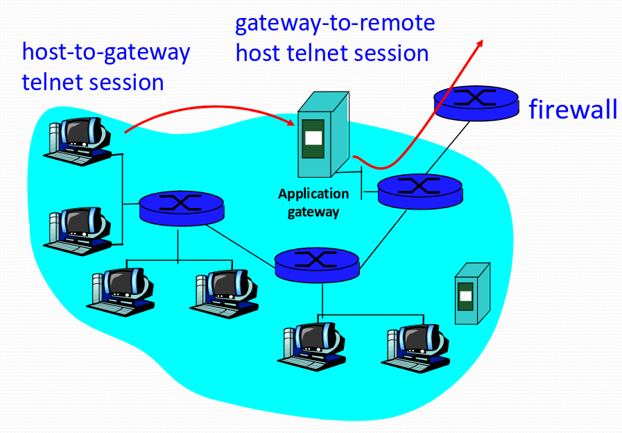

#### Motivation for Gateways
- Enable more detailed policies, e.g. login id and password at Telnet gateway.
- Avoid rogue machines sending traffic, e.g. e-mail "server" running on user machine, probably a sign of a spammer.
- Enable a central place to perform logging, e.g. forcing all web accesses through a gateway to log the IP addresses and URLs.
- Improve performance through caching, e.g. forcing all web accesses through a gateway to enable caching of the popular content.

---
## Web Proxies
Proxy is a server to the client and a client to the server.

---
### Proxy Caching
- Faster reponse time to the clients.
- Lower load on the web server.
- Reduced bandwidth consumption inside the network.

---
#### Getting request to the proxy
Explicit configuration:
- Browser configured to use a proxy.
- Directs all requests through the proxy.
- Problem: requires user action

Transparent proxy (interception proxy)
- Proxy lies in path from the client to the servers.
- Proxy intercepts packets during route to the server
- ... and interposes itself in the data transfer.
- Benefit: does not require user action.

---
#### Challenges of Transparent Proxies
- Must ensure all packets pass by the proxy, by placing it at the only access point to the Internet e.g. at the border router of a campus or company.
- Overhead of reconstructing the requests. Must intercept the packets as they fly by, and reconstruct into the ordered by stream.
- May be viewed as a violation of user privacy as it may be keeping logs of the user's requests.

---
### Other functions of Web Proxies
- Anonymization: server sees requests coming from the proxy address, rather than the individual user IP addresses.
- Transcoding: converting data from one form to another, e.g. reducing the size of images for cell phone browsers.
- Prefetching: requesting content before the user asks for it.
- Filtering: blocking access to sites, based on URL or content.

---
# Lecture 9: Software Defined Networking (SDN)

---
# Lecture 10: Network security
- **Confidentiality**: only sender and intended receiver should understand message contents.
- **Authentication**: sender, receiver want to confirm identity of each other.
- **Message integrity**: sender, receiver want to ensure message not altered without detection.
- **Access and availability**: services must be accessible and available to users.

---
Malicious operations:
- **Eavesdrop**: intercept messages, and actively insert messages into connection.
- **Impersonation**: can fake source address in packet.
- **Hijacking**: take over ongoing connection by removing sender or receiver, inserting himself in place.
- **Denial of service**: prevent service from being used by others e.g. by overloading resources.

---
### Symmetric key crypto
- Requires sender, receiver know shared secret key.

### Public key crypto
- Sender, receiver do not share secret key.
- Public encryption key known to all.
- Private decryption key known only to receiver.

### RSA in practice: Session key
Use public key crypto to establish secure connection, then establish second key -- symmetric session key -- for encrypting data.